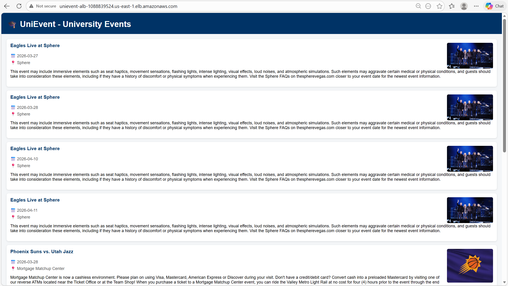
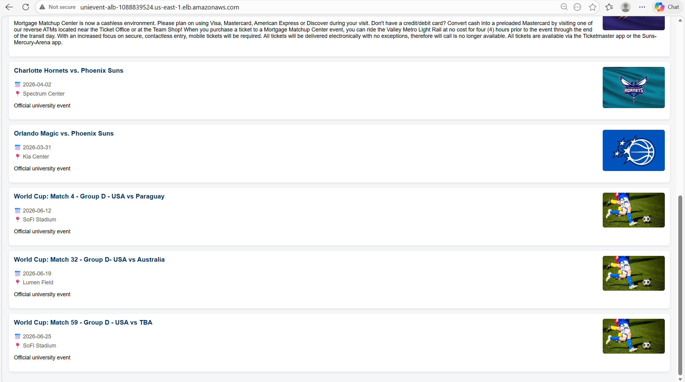
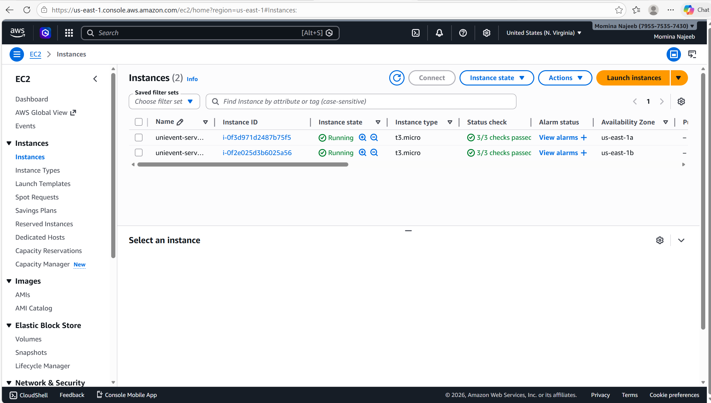
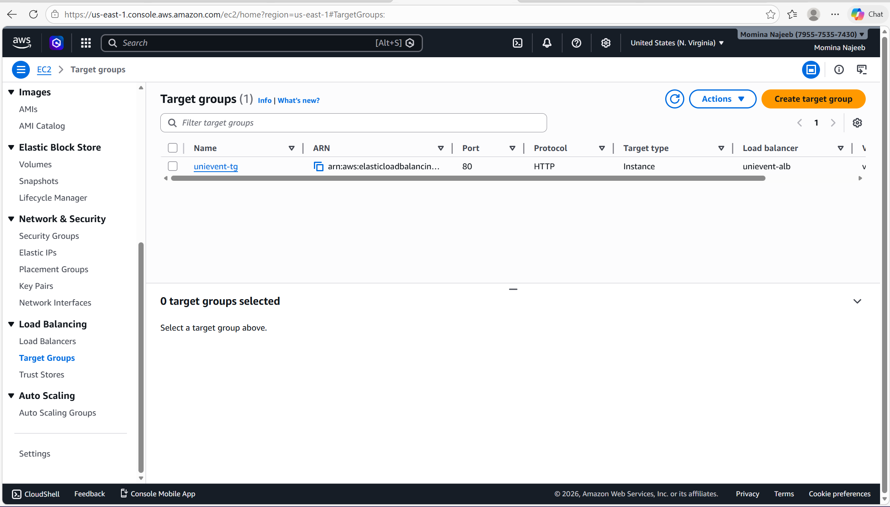
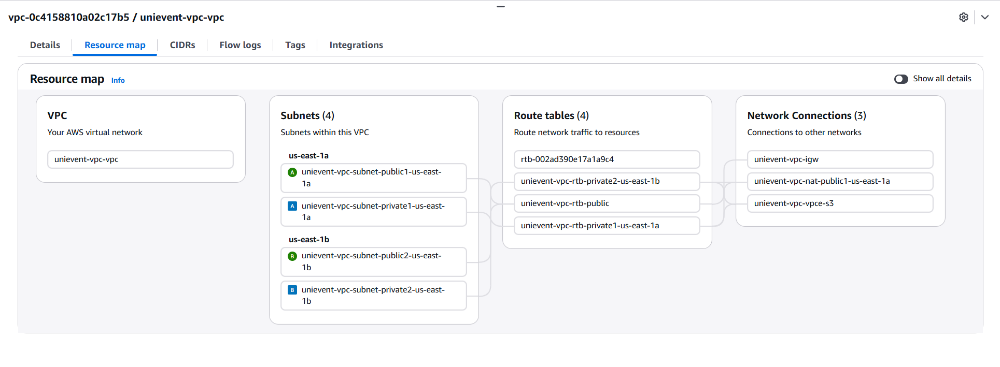

# UniEvent - AWS Cloud Deployment

## 📌 Project Overview

UniEvent is a cloud-based university event management system deployed on AWS. The system allows users to browse events fetched automatically from an external API and view event details such as name, date, venue, and images.

---

## 🧠 Architecture Overview

The system is designed using AWS cloud services to ensure scalability, availability, and security.

### 🔹 Services Used:

* **VPC** – Custom network with public and private subnets
* **EC2** – Hosts the web application (Flask)
* **S3** – Stores event images/media securely
* **Elastic Load Balancer (ALB)** – Distributes traffic
* **IAM** – Manages secure access control

---

## ⚙️ System Design

1. The application runs on **two EC2 instances** inside private subnets.
2. An **Application Load Balancer** routes incoming traffic to EC2 instances.
3. The application fetches event data from the **Ticketmaster API**.
4. Event images are handled using **S3 storage**.
5. The system continues to work even if one EC2 instance fails.

---

## 🔄 Workflow

1. User accesses the application via Load Balancer URL
2. Request is routed to one of the EC2 instances
3. EC2 fetches event data from Ticketmaster API
4. Data is processed and displayed to the user

---

## 🔐 Security Features

* EC2 instances are deployed in **private subnets**
* No public IP assigned to backend servers
* IAM roles used instead of storing credentials
* S3 bucket access is restricted

---

## 📸 Screenshots
### Load Balancer

### EC 2 Instance

### Target Group

### VPC Resource Map

---

## 🚀 Deployment Steps (Summary)

1. Created IAM user and roles
2. Set up VPC with public and private subnets
3. Created S3 bucket for storage
4. Launched two EC2 instances
5. Deployed Flask application
6. Configured Application Load Balancer
7. Integrated Ticketmaster API

---

## 📌 Conclusion

This project demonstrates a scalable and fault-tolerant cloud architecture using AWS services. The system efficiently handles traffic, ensures high availability, and follows cloud security best practices.

---
